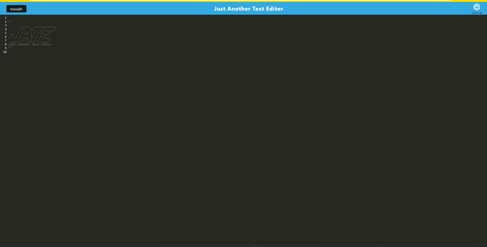

# Just Another Text Editor 

## Description 

This project was an attempt to create a text editor. It has offline funcationality, online functionality, stores data via a cache for quick access and offline viewing.

 
## Table of Contents
 
- [Installation](#installation)
- [Usage](#usage)
- [Questions](#questions)
- [Tests](#tests) 

##  Installation 

Use the `npm install` command to install all needed modules

Run `npm start` for the scripts to build webpacks, open servers for server side and client side.

## Usage 

Deployed application :  https://text-editor-2022-12.herokuapp.com/

 

## Questions 

If you have any questions or concerns, please reach out to Tab-Y at tlyoumans@gmail.com. 
